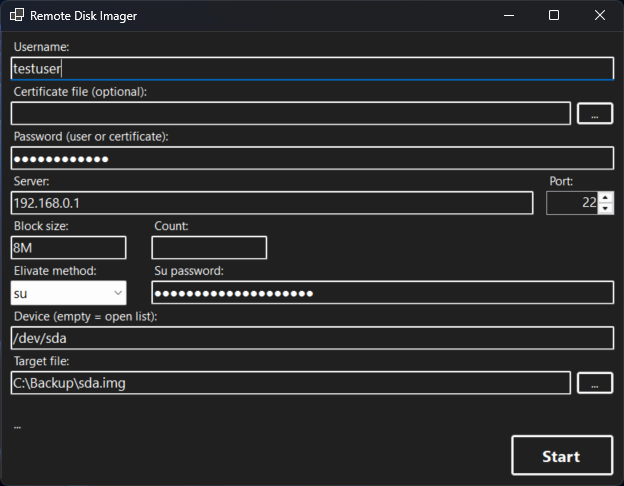

# RemoteDiskImager
Pull an image of a linux block device via pure SSH

## Idea
The problem I saught to solve here, was to create a disk image of a Raspberry Pi's SDCard without disassembling its casing. I do have sudo privileges but there are some essetial tools and privileges missing thus I restricted myself to work with this:
- Use a single SSH connection
- No SFTP or port forwarding
- Directly consuming the output of `dd`
- Collecting found block deviced with `lsblk`

Also, the tool should be easy used by inexperienced users. Thus, the tool should be a wizard leading through what is needed.

The connection is usually initialized with a lower privileged user who has to evivate to su privileges. For this, the tool has to support `su` and `sudo` due to the different server configurations.


## Usage (CLI version)
```text
RemoteDiskImager [options] <user>@<host>[:<path>] <target>

Options:
  -p, --port <port>            SSH port number (default: 22)
  -P, --password <password>    SSH or certification password
  -I, --cert <file>            SSH server certificate file
  -s, --su                     Use 'su' to gain root privilege
  -d, --sudo                   Use 'sudo -s' to gain root privilege
  -S, --su-password <password> Password for 'su' or 'sudo'
  -b, --block-size <size>      Block size (default: 8M)
  -c, --count <count>          Number of blocks to copy (default: all)
  -h, -?, --help               Show this help message
```

To start the tool with minimal options, just give it `<user>`, `<host>` and `<target>`, e.g.:
```sh
RemoteDiskImager testuser@192.168.0.1 C:\backup\test.img
```

You can also use a not detected block device or a simple file just by passing it, e.g. getting 10 * 10MB of randon data:
```sh
RemoteDiskImager -b 10M -c 10 testuser@192.168.0.1:/dev/random C:\backup\random.img
```

To use a certification file to connect, specify it via `-I <file>>`. The tool will try to open it and if it fails will ask for its passphrase which you can also pass via `-P <password>`:
```sh
RemoteDiskImager -I C:\Users\test\.ssh\testuser.ppk testuser@192.168.0.1 C:\backup\test.img
```

To use `su` to elivate privileges to access a block device, pass the `-s` parameter. The tool will ask for the su password individually or you can password via `-S <passwork>`. 
```sh
RemoteDiskImager -s testuser@192.168.0.1 C:\backup\test.img
```

The same is true for the `-d` parameter to use `sudo` to elivate. It won't use the login password here so you'll have to specify it twice, leaving it empty will assume the passwort to be empty or `NOPASSWD:` being in place for `dd`.


## Usage (UI version)
The UI version is a simple Windows Forms application. I uses the same logic, though, even using the same code. The CLI parameters can be useed to prefill the fields. The rest should be self-explanitory.


